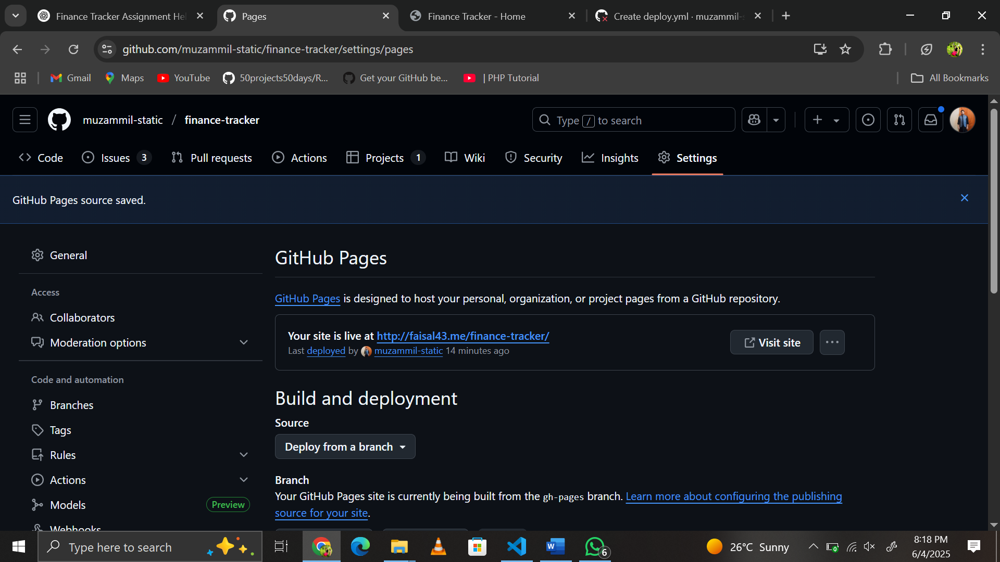

# Phase 5: Deployment

## Overview

In this phase, we deployed our **Finance Tracker** project to GitHub Pages using **GitHub Actions** for automated continuous deployment. This ensures the site is published every time changes are pushed to the main branch.

---

## Step-by-Step Deployment

### 1. GitHub Pages Configuration

We navigated to the **Settings > Pages** section of our repository and selected **GitHub Actions** as the source for deployment.

📌 **Figure 11**: GitHub Pages configuration  


---

### 2. Added `deploy.yml` Workflow

A custom workflow file was created at `.github/workflows/deploy.yml` with the following configuration:

```yaml
name: Deploy Finance Tracker to GitHub Pages

on:
  push:
    branches:
      - main

jobs:
  deploy:
    runs-on: ubuntu-latest
    steps:
      - name: Checkout Repository
        uses: actions/checkout@v3

      - name: Setup Node.js
        uses: actions/setup-node@v3
        with:
          node-version: '18'

      - name: Build
        run: echo "No build step required for static site."

      - name: Deploy to GitHub Pages
        uses: peaceiris/actions-gh-pages@v3
        with:
          github_token: ${{ secrets.GITHUB_TOKEN }}
          publish_dir: ./src
```
📌 **Figure 12**: Deployment of yml file 


### 3. Workflow Execution and Fixes
Initially, the deployment failed due to permission issues (403 error). This was resolved by:
Ensuring the repository is public
Verifying the default GITHUB_TOKEN has write permissions
Re-running the workflow
📌 **Figure 13**: Successful Github Actions Run


### Final Deployment Link
🔗   https://muzammil-static.github.io/finance-tracker/
