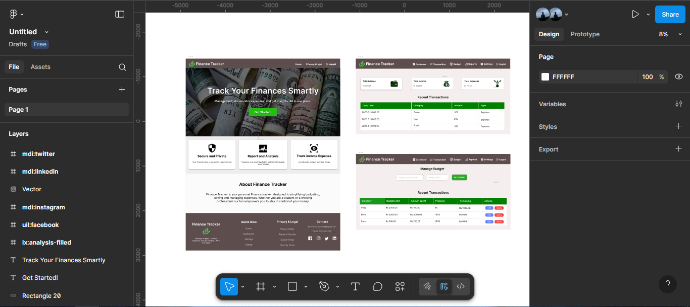
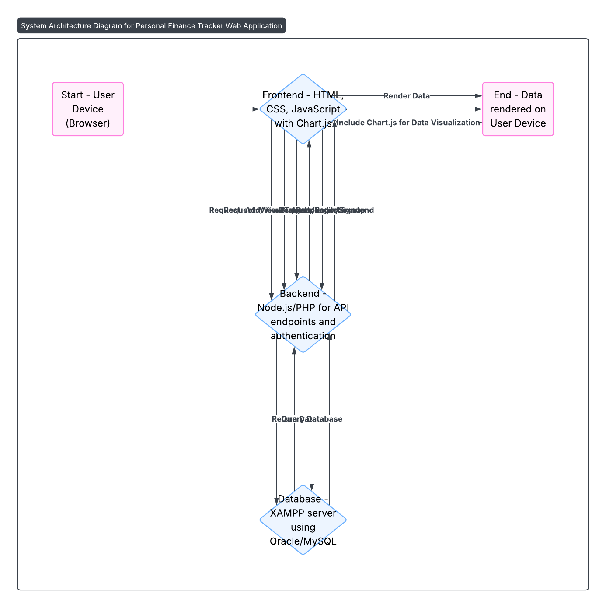
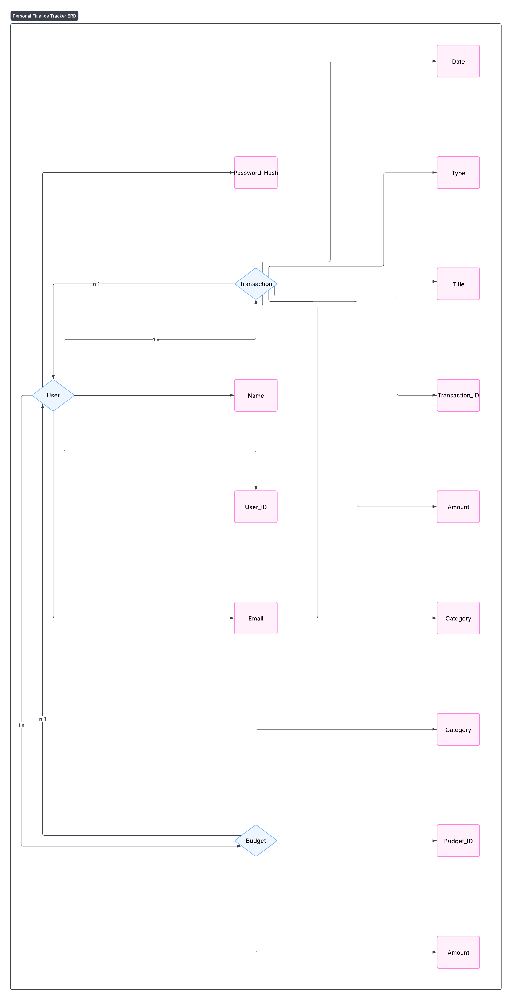

# 🎨 Design Phase – Personal Finance Tracker

---

## 👨‍💻 AI Tool Used: Lucidchart AI

**Purpose:**  
To generate clean, structured design visuals including UI wireframes, system architecture diagrams, and ER diagrams for the project.

---

## 1. 🖼️ Wireframe – Dashboard Page

> Description: Wireframe created using Figma showing Total Balance, Recent Transactions, Budget Summary (Progress Bars).

**Screenshot**:  

---

## 2. 🧱 System Architecture Diagram

> Description: Frontend communicates with backend (Node.js/PHP), which interacts with the XAMPP-hosted database (Oracle/MySQL). Includes user auth, transaction flow, and report generation.

**Screenshot**:  

---

## 3. 🗃️ ER Diagram – Database Schema

> Description: Lucidchart AI-generated ERD showing relationships among `Users`, `Transactions`, and `Budgets` tables.

- **Users** (`User_ID`, `Name`, `Email`, `Password_Hash`)
- **Transactions** (`Transaction_ID`, `User_ID`, `Title`, `Amount`, `Type`, `Date`, `Category`)
- **Budgets** (`Budget_ID`, `User_ID`, `Category`, `Amount`)

**Screenshot**:  

---

## ✅ Summary

Using **Lucidchart AI** and **Figma**, we generated the following artifacts to enhance clarity and development speed:

- Clean wireframes for key pages.
- A high-level system architecture diagram.
- A well-structured ER diagram.

These designs will guide the next phase (Development), ensuring all components are well-understood before implementation begins.

