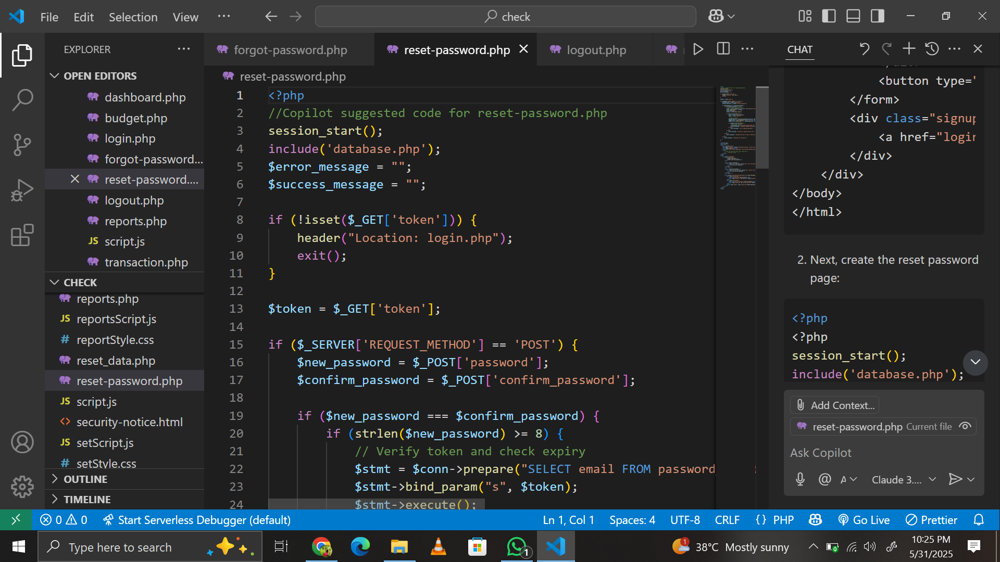
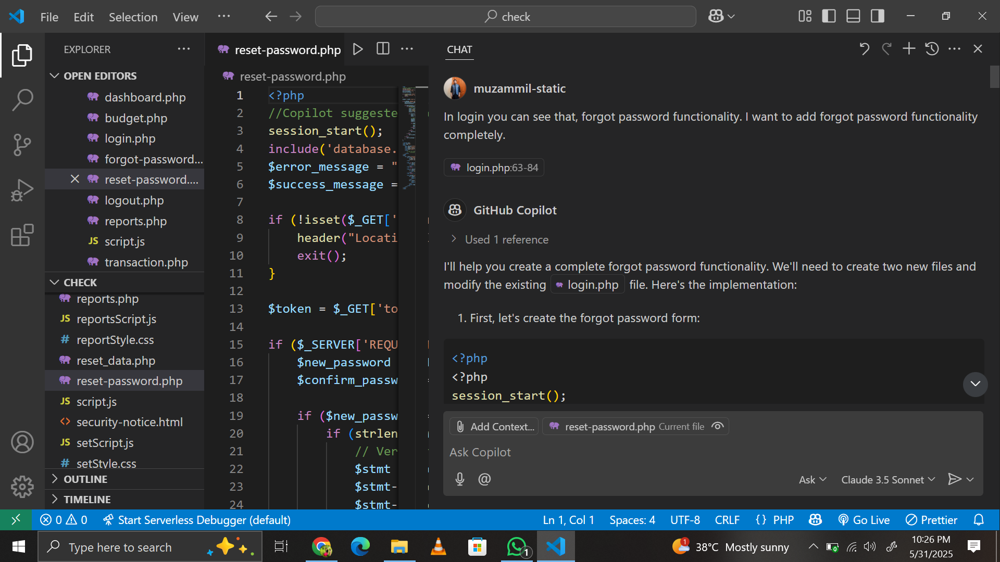

# Phase 3: Development

## 🧠 AI Tool Used
- **GitHub Copilot**  
  GitHub Copilot was used as an AI coding assistant during implementation. It helped generate JavaScript logic for transactions, budget handling, user login/signup, and rendering financial reports with Chart.js.

---

## 🔧 Process Followed

### 1. Project Setup
- Source files were created in Visual Studio Code.
- Project folder structure:
├── index.html
├── dashboard.php
├── transactions.php
├── budgets.php
├── scripts/
│ ├── script.js
│ └── charts.js
├── styles/
│ └── styles.css
└── auth/
├── login.html
└── signup.html

## Screenshots



### 2. GitHub Copilot Usage
GitHub Copilot was used to:
- Generate the forgot password logic.
- Create budget alerts and dynamic chart rendering.
- Write form validation code for login/signup pages.

#### Example: Forgot password and reset password
```js
// Code below suggested by GitHub Copilot
if (filter_var($email, FILTER_VALIDATE_EMAIL)) {
        // Check if email exists
        $stmt = $conn->prepare("SELECT user_id FROM users WHERE email = ?");
        $stmt->bind_param("s", $email);
        $stmt->execute();
        $result = $stmt->get_result();
        
        if ($result->num_rows > 0) {
            // Generate token
            $token = bin2hex(random_bytes(32));
            $expiry = date('Y-m-d H:i:s', strtotime('+1 hour'));
            
            // Store token in database
            $stmt = $conn->prepare("INSERT INTO password_reset_tokens (email, token, expiry) VALUES (?, ?, ?)");
            $stmt->bind_param("sss", $email, $token, $expiry);
            
            if ($stmt->execute()) {
                // Send reset email
                $reset_link = "http://" . $_SERVER['HTTP_HOST'] . "/check/reset-password.php?token=" . $token;
                $to = $email;
                $subject = "Password Reset Request";
                $message = "Click the following link to reset your password: " . $reset_link;
                $headers = "From: noreply@yourwebsite.com";
                
                if (mail($to, $subject, $message, $headers)) {
                    $success_message = "Password reset instructions have been sent to your email.";
                } else {
                    $error_message = "Error sending email. Please try again.";
                }
            } else {
                $error_message = "An error occurred. Please try again.";
            }
        } else {
            $error_message = "No account found with this email address.";
        }
    } else {
        $error_message = "Invalid email format.";
    }*/
}

