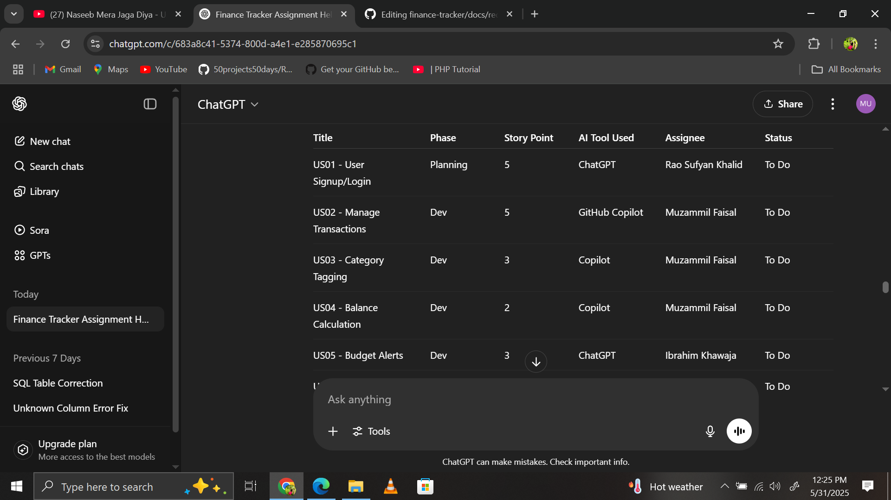

# 📘 Requirements Document – Personal Finance Tracker

---

## 👥 Group Members

1. Rao Sufyan Khalid – Project Manager  
2. Muzammil Faisal – Developer  
3. Ibrahim Khawaja – Tester

---

## 📌 Functional Requirements

1. Users can sign up and log in to their personal account.
2. Users can add, edit, delete, and view transactions (income/expenses).
3. Each transaction includes title, amount, category, type (income/expense), and date.
4. Budgets can be set by category and compared against expenses.
5. Alerts are shown if user exceeds a budget category.
6. Dashboard displays total balance and summary.
7. Charts (pie/bar) show financial data visually.
8. Users can change currency and toggle dark mode.
9. Users can reset their data completely.

---

## ⚙️ Non-Functional Requirements

1. **Security**: Passwords must be securely hashed; users must access only their data.
2. **Performance**: Pages should load in under 1 second with optimized chart rendering.
3. **Usability**: UI must be clean, mobile-responsive, and easy to navigate.
4. **Reliability**: Data persistence via XAMPP backend (MySQL or Oracle).
5. **Maintainability**: Organized code structure using Git and GitHub.
6. **Scalability**: System should support future features (e.g., PDF export, notifications).

---

## 🤖 AI Tools Used in Planning Phase

### Tool: **ChatGPT**
**Purpose:** Generate clear user stories, define functional requirements, and estimate complexity.  
**Process:**
- Prompted ChatGPT to generate and refine user stories.
- Used ChatGPT to define database table structure.
- Received estimates for story points and task breakdown.

### AI-Generated User Story Example:
> As a user, I want to add, view, edit, and delete transactions so I can manage my income and expenses.

---

## 📋 Project Planning & Tracking

### Tool: **GitHub Projects Board**

- Used GitHub Projects (table view) to manage tasks across SDLC phases.
- Fields included: Task Title, Description, Phase, Story Points, Assignee, AI Tool Used.
- Each task is linked to one SDLC phase (e.g., Planning, Development, Testing).

---

## 🖼️ Screenshots

### 📷 Figure 1: ChatGPT prompt for requirement analysis
_Attached screenshot showing how ChatGPT generated user stories and helped refine requirements._

---

### 📷 Figure 2: GitHub Project Board Overview
_Screenshot of GitHub Project Board showing all tasks, phases, story points, and assignments._

---

## ✅ Summary

In the Planning & Requirements Phase:
- Used **ChatGPT** to assist in generating user stories and estimating complexity.
- Tracked all stories and tasks using **GitHub Projects**.
- Functional and non-functional requirements were structured based on real-world financial tracker needs.

This phase ensures a well-defined scope and smooth coordination among team members.
